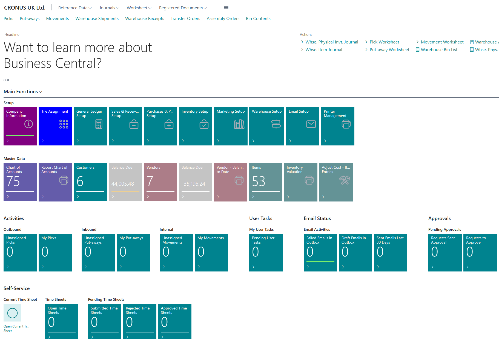

# EasyTiles

Create dynamic tiles in Business Central

This is an experiment to create a dynamic tile solution based on standard building block. The goal is to be as close to AL as possible.

Let’s have a look at the main objectives:

-   Give the users the option to add and remove tiles without any code.
-   The tiles need to mimic the standard function: display a count / sum and open a drilldown.
-   Add the option to run objects.
-   Different tile groups per role centre

Nice to haves:

-   Conditional formatting like in some standard cue groups
-   Change static background colour
-   Show/Hide numeric value
-   Display a custom Icon

Design

Because this is an experiment I couldn’t and didn’t want to implement a full custom tile engine and there are products for that anyway. So here are the principals:

-   5 group of tiles per Role Centre
-   20 tiles per group in configuration of 2x10 or 4x5

I choose the 20 tiles as a limit because it seemed enough to display any role related lists, drilldowns and additional function shortcuts.



If this wouldn’t be enough it is easy to add more groups to the role centre page and to the configuration.

Challenges

-   Role Centre pages don’t run code: how can I remove the unassigned tile groups
-   Edit the group captions
-   Edit the tile itself: colour, hide counter, add icon

Sounds like we need a control-addin to overcome the challenges. Well, I’m first and foremost an AL guy so JavaScript, CSS and advanced html dom is really not my cup of tea. So the code in the add-ins going to be rudimentary at best but they do the job and hopefully in an understandable manner. No fancy code there for sure!

That concludes the introduction in the follow-up I’ll explain what did I do and why…

## The Activity Part Page

Our selection of tiles will be hosted by the activity part page. It contains the 20 tiles once in a 2x10 and 4x5 configurations.

To draw the page, we’re going to use a temporary source table: 80100 "Easy Tile Buffer" with:

-   Instillation fields: tile group id, caption, group captions
-   20 Position indicator fields
-   20 Caption Fields: caption property
-   20 Visibility Fields: visible property
-   20 Style Fields: style expression property
-   20 Value Fields: source expression property

During the page load we’re calculating the initial values for all the 20 tiles.

**2x10 configuration:**


**4x5 configuration:**


The page 80101 "Easy Tile Activities" contains all the visible elements and the control add-in to modify the role centre layout.

## Tile Group Visibility issue

The problem we need to solve is how to hide the placeholder whit no tiles or tile group assignment. Since the role centre page is not running code, we can’t make them hide or show. To achieve this, we need a control add-in which can remove the unnecessary activities:


### The add-in

Client add-ins are well documented in other articles, so I won’t get into the details too much but when it is necessary I’ll do my best to explain what needs to be done to achieve the goal we set for ourselves. Look at the code in the src\\controladdin\\EasyTileController folder.

The main functions:

-   Set visibility
-   Change Caption
-   Change group caption
-   Set tile style

**Setting visibility**

Before we jump in, we need to have a look at the general layout of the rolecentre page and how the client add-ins are rendered.

Use the built in inspect tool in your browser (I’m using Edge) to look at the html structure of the page. With the help of the selector tool highlight the first placeholder:


Because on the role centre we have 5 discreet tile groups first we need an anchor which gives us the opportunity to find the tile group – activity page.

Once the add in is loaded following function is run if there is no visible tiles or no group is assigned for the placeholder with the parameters:

Elemntid: calculated by the page from this formula: [title="Actions for TileGroup%1"] the %1 is the number of the tile group.

```
function FindAndRemoveTileGroup(elementid) {
    nodes = window.parent.document.querySelectorAll(elementid); //find all controls by page name
    parentnodes = nodes[nodes.length - 1].offsetParent;
    parentnodes.remove();
}
```
